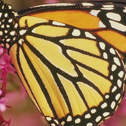

# Image Super-resolution Using Deep Learning

## Aim
to obtain practical knowledge and hands-on understanding of the concepts of image super-resolution, deep learning using convolutional neural networks (CNN) and peak signal-to-noise ratio (PSNR)

## Understanding image super-resolution
Objective: To become familiar with the image super-resolution problem setting.

1. To read the image named butterfly_GT.bmp
2. To show the size of this image
3. To convert the image from the RGB colour space into the gray-scale space
4. To shrink the current image by 3 times with bicubic interpolation algorithm 
(Tip: imresize is a Tensorflow build-in function)
5. To enlarge the current image by 3 times with bicubic interpolation algorithm

##  Understanding deep learning by convolutional neural network
Objective: To understand the principles of deep convolutional network

1. To load the pre-trained model named model.npy
2. To set and show the weights of the first convolutional layer
• To set the filter number
• To set the filter size
3. To set and show the weights of the second convolutional layer
• To set the filter number
• To set the filter size
4. To set show the weights of the third convolutional layer
• To set the filter number
• To set the filter size
5. To perform 2-d convolution filtering on a 2-d matrix


## Image super-resolution using deep convolutional network
Objective: To perform image super-resolution with deep convolutional neural network and evaluate its performance

1. To get and show the Ground Truth image
2. To get and show the low-resolution image
3. To get the input image into the SRCNN
4. To call SRCNN to super-resolve the input image
5. To get and show the output high-resolution image by SRCNN
6. To compute the PSNR of the high-resolution image against the Ground Truth 
image
7. To get the high-resolution image with bicubic interpolation algorithm 
(baseline result)
8. To compute the PSNR of the baseline result


## Result

**Visualisation of weights**


**Result of image**

Original


Ground Truth


Blurred Image


Result Image


```
PSNR between blurred and SR images is 29.936239848900776
```


## Reference

Dong, Chao, Chen Change Loy, Kaiming He, and Xiaoou Tang. "Image super-resolution using deep convolutional networks." IEEE transactions on pattern analysis and machine intelligence 38, no. 2 (2015): 295-307.
